# Instruments
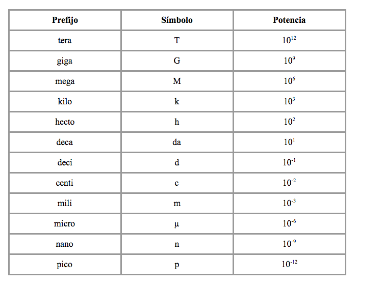

- TGM
- kilo, hecta, da
---
- d, c, m
- μ (micro) , nano, pico

------------------------
**Mesures**
- Voltatge: V
- Resistència: Ohms
- Intensitat: Amperes
- Periode: 1μs / 1ns = Segons
- Freqüència: Hz

## 1. Font alimentació
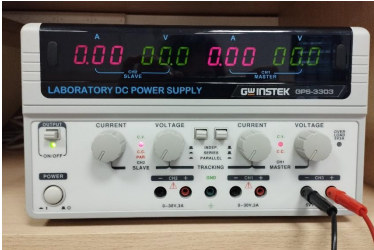

1. Botó Power: l'engega
2. Botó Output: activa sortides (en Off quan es manipula la protoboard)
3. Conectar cables (negre i vermell) a CH3.

## 2. Generador d'ones i les sondes
Font de senyals:

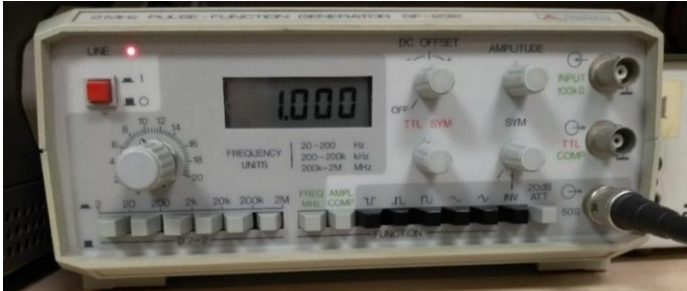

1. S'engega amb el botó vermell
2. Es selecciona tipus d'ona amb botons negres (Function)
    - Ficar sempre el 2n (senyal quadrada)
3. Freqüència: Botons grisos (entre 2Hz i 2MHz)
    - **Potenciòmetre**: modular freqüència amb rodete entre 2 i 20. Es veu a la pantalla
4. Sondes:
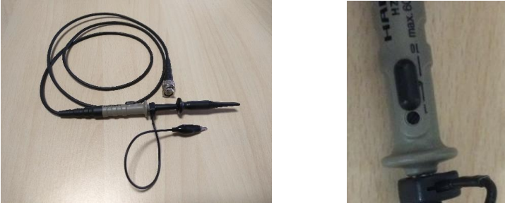
Connectar el cable abaix a la dreta i els altres 2 extrems a:
    4.1. Cable de toma a GND
    4.2. Cable d'on es vol medir

El pinxo te un botó que es desplaça verticalment entre 2 posicions: 1 i 10 (segona imatge)
    - És el factor d'atenuació i ha d'estar sempre a 1

## 3. Oscil·loscopi
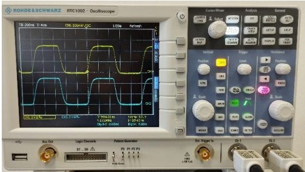

Permet veure les senyals d'entrada i sortida. Es pot veure:
1. Amplitud --> Eix Y
    - Voltatge
    - Tensió
2. Temps --> Eix X
    - Periode
    - Freqüència

Funcions:

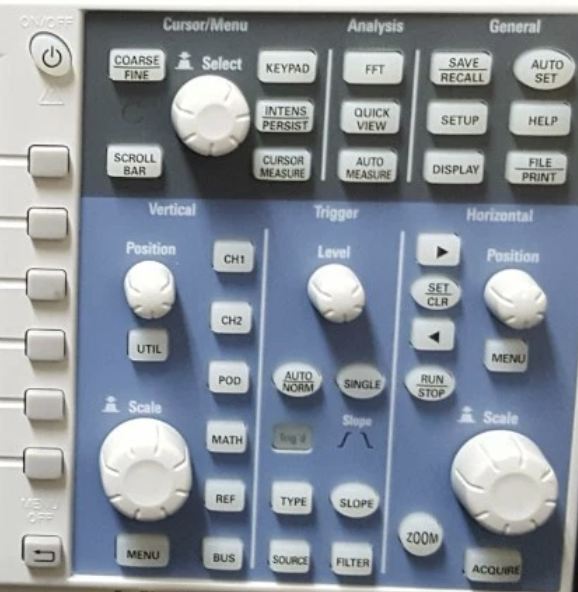
1. Roda Scale: eix horitzontal (temps)
    - El valor es pot veure a dalt a l'esquerre (TB)
    - L'eix vertical es veu a la part inferior a l'esquerre (voltatge x canal)

2. Position: rodete per moure en quin la posició

3. Trigger > level: Estabitlitza la imatge de les senyals

4. File/Print: captura pantalla

5. Run/Stop: parar imatge mostrada

### Anàlisis senyals
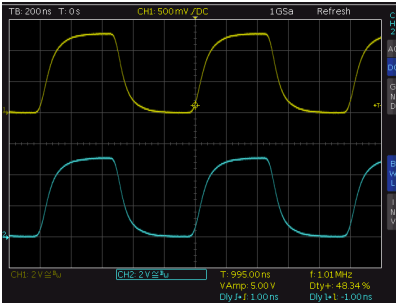

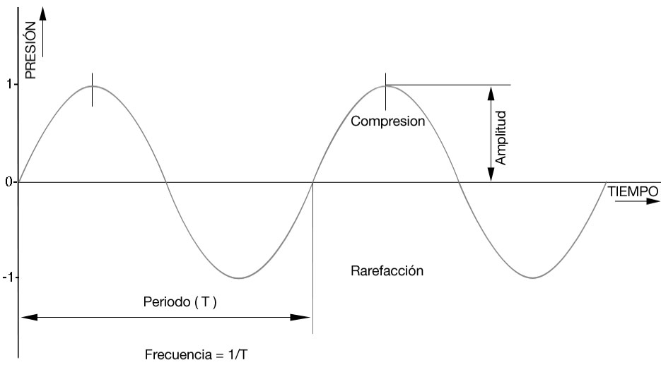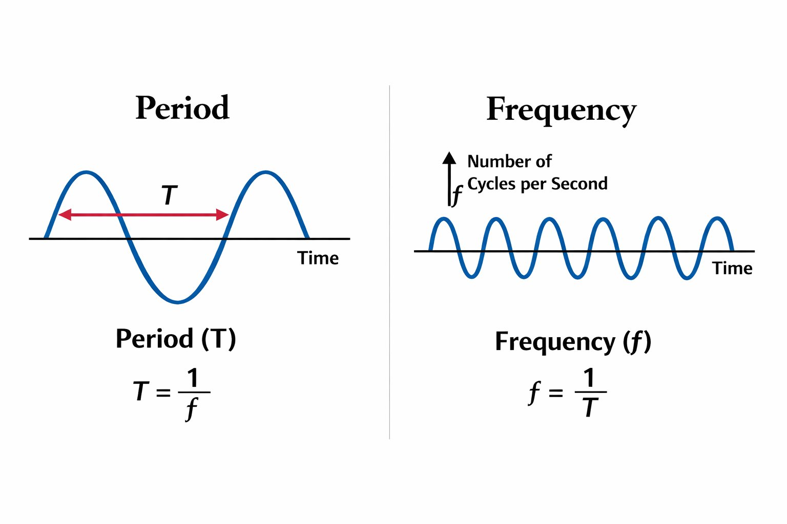

1. TB (Base de Temps): 200ns = 0,2μs per divisió o quadrat
    - Cada subdivisió = 0,2 / 5 = 0,4μs
    - Periodo = 5*0,2 = 1μs
    - Freqüència: 1μs x segon = 1MHz

2. Voltatge: 2V = cada quadrat són 2 volts
    - Amplitud = 2V * 2,5 quadrats = 5V

3. Cursor measure (botó):

    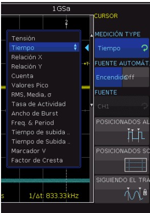
    
    - Medición Type: ficar temps per defecte

    - Fuente automática: agafa automáticament la font seleccionada (activarla)

    - Fuente: si la fuente automática està desactivada, s'ha de seleccionar aquí

    - Rodeta "Select": Escull el paràmetre a mesurar i es selecciona apretant

    - Posicionados:
        - AL: Cursors a posició òptima
        - SC: Posició predeterminada
        - Siguiendo trazo: manté la posició inclús variant l'escala
    
    - Menú OFF: amaga el menú

## 4. Multímetre o tester
Saber si es vol mesurar:
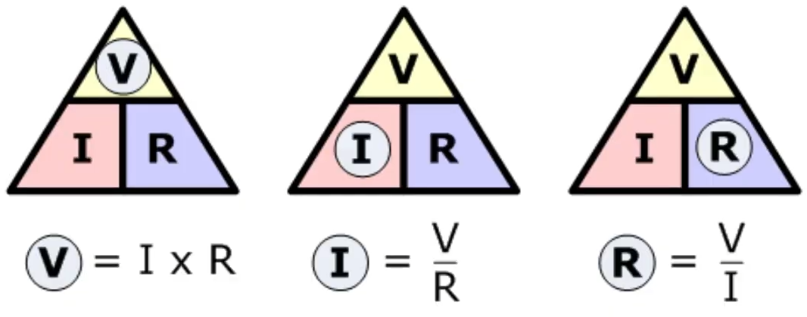

1. Tensions / Resistència (vermell a la dreta):
    - Voltatge (contínua):
        - A 40V (treballem de 0 a 5V)
    
        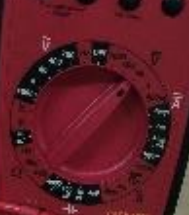

    - Resistència:
        - Font apagada
        - A 400Ω o 40kΩ ohmios (treballem amb 1kΩ)

        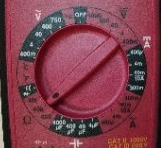
        

2. Intensitat/corriente (vermell a l'esquerre):
    - Es mesuren Ampers
    - A 4m - DC
    - Circuit anant

    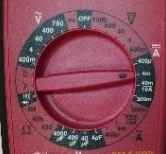

## 5. Protoboard
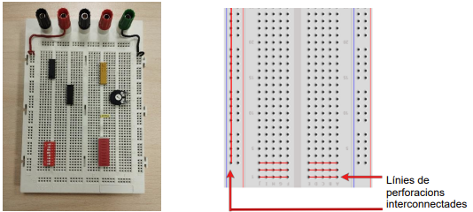

Ficar cables de Font d'alimentació a: vermell de dalt i verd d'abaix:
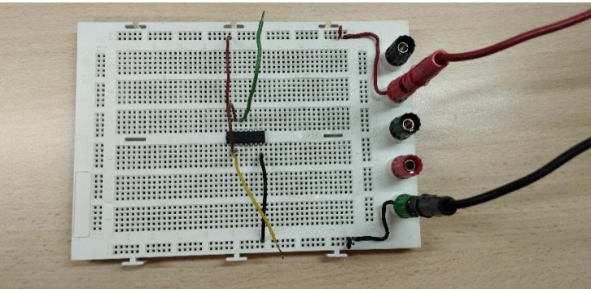

# Chips
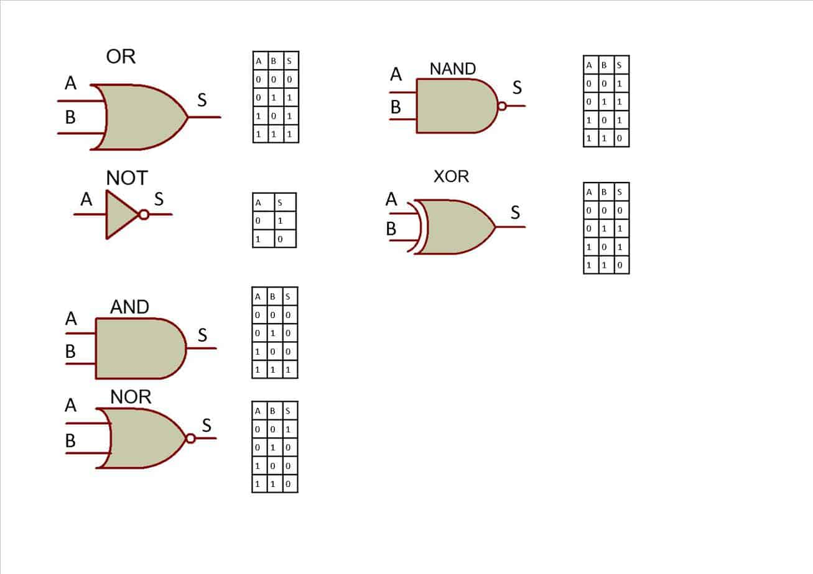

## Tabla de ayuda:
| Num | Función |
|-----|---------|
| 00 y 10 | NAND (2 y 3) |
| 04 - 06 - 13 - 14 | Inversor |
| 47  |  Decodificador |
| 76  | Flip-Flop  |
| 86  | XOR  |
| 125A - 126A | Tristates  |
| 193 | Contador

## NAND:
1. SN54/74LS00 --> 2 portes

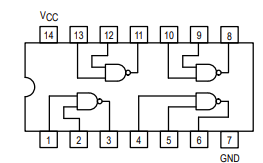

2. SN54/74LS10 --> 3 portes

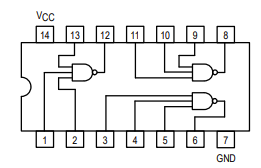

## Inversor (NOT):
1. SN54/74LS04 --> Con diodos Schottky

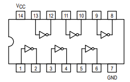

- Usas el LS04 cuando simplemente quieres invertir una señal TTL limpia.
- Más rápido y consume menos que el TTL clásico

2. SN54/74LS06 / HD74LS06 --> Open collector

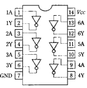

- Para leds + resisstencia externa

3. SN54/74LS13 --> Schmitt Trigger 

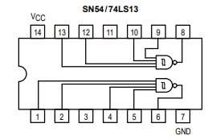

- Schmitt Trigger: limpia el ruido de la señal a través de tener un baremo que permite dar algo de margen:

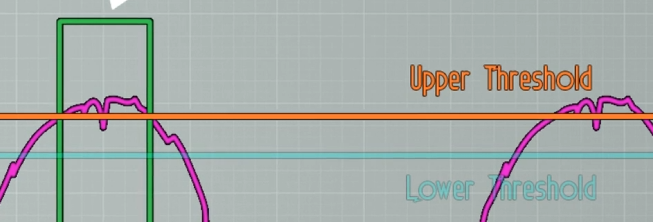

4. SN54/74SL14 --> Schmitt Trigger

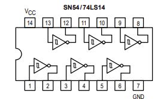

## XOR
1. SN54/74LS86

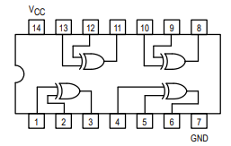

## Buffers (tristates)
1. SN54/74LS125A

Si hi ha H a 1a entrada no surt res (tristate). Si hi ha H a 2a entrada, H

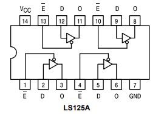 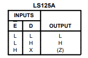

2. SN54/74LS126A

Si hi ha L a 1a entrada no surt res (tristate). Si hi ha L a 2a entrada, L

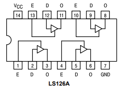 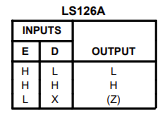

## Biestable
1. LS76A --> Flip Flop dual JK

Flip-flop clásico JK con entradas asíncronas de preset (activo LOW) y clear (activo LOW)

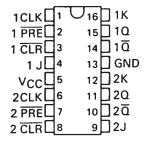 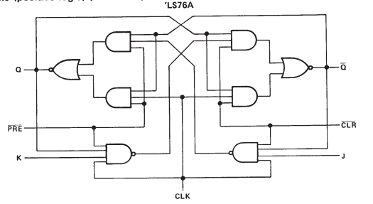

- J = Set
- K = Reset

Tabla de verdad Flip-Flop JK:

| J | K |-| Q | Q' | Función |
|---|---|-|---|----|---------|
| 0 | 0 |-| X | X  | Memoria
| 1 | 0 |-| 1 | 0  | Set Q a 1
| 0 | 1 |-| 0 | 1  | Reset Q a 0
| 1 | 1 |-| 0 | 1  | Complementar (cambia salida como un inversor)

## Contador
1. DM74LS193

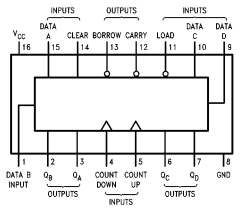

- Flip flops encadenados. Con 4 tienes 4 bits
- El FF2 obedece a los cambios de FF1, el FF3 al de FF2...

## Decodificador
1. DM74LS47

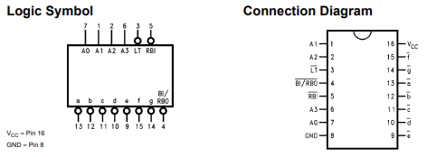

- Pantalla que muestra números
- Entrades desiguals